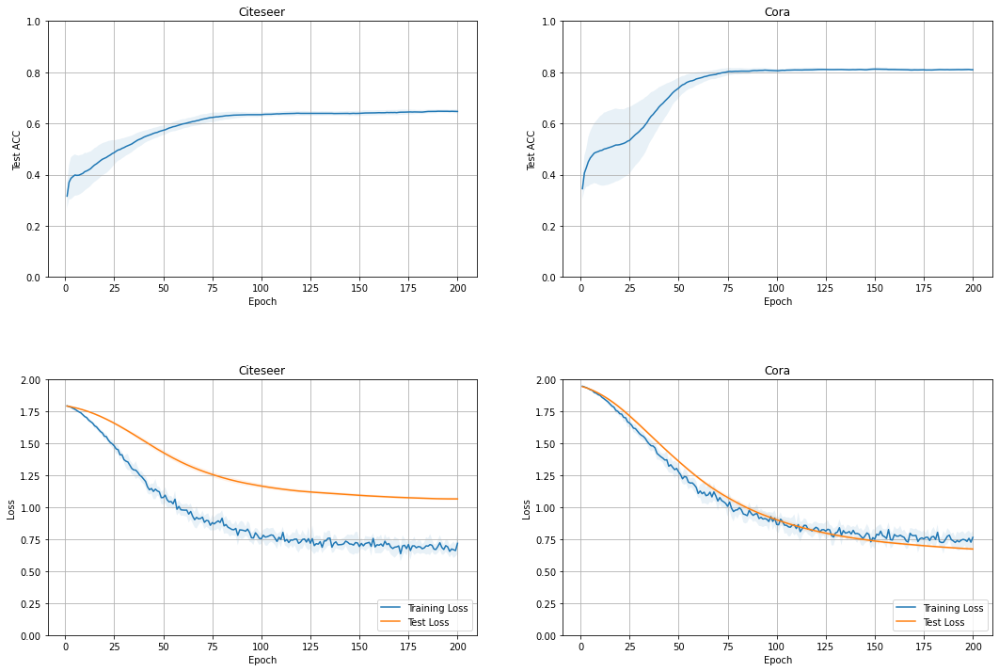

# Graph Convolutional Networks (GCN) with PyTorch

This repository is for a simple implementation of Graph Convolutional Networks. The original paper of GCN is [here](https://arxiv.org/pdf/1609.02907.pdf).

## Datasets
In this repository, there are 2 datasets provided to train the GCN model:
    - Citeseer
    - Cora
Two datasets can be downloaded in [here](https://linqs.soe.ucsc.edu/data). The downloaded datasets should be unziped and restored into a directory named `datasets`. The following tree shows the path to each files in the datasets:

```
datasets
├── citeseer
    ├── citeseer.cites
    ├── citeseer.content
    └── README
└── cora
    ├── cora.cites
    ├── cora.content
    └── README
```

## Install Dependencies
1. Install Python 3.
2. Install the Python packages in `requirements.txt`. If you are using a virtual environment for Python package management, you can install all python packages needed by using the following bash command:

    ```bash
    $ pip install -r requirements.txt
    ```

3. Install PyTorch. The version of PyTorch should be greater or equal than 1.7.0. This repository provides the CUDA usage.

## Training
1. Modify `config.json` as your machine setting. The following explanations are for understanding `train_config` of `config.json`:
    - `num_epochs`: The number of epochs of the training process. Default: 200
    - `learning_rate`: The learning of the optimizer for the training process. Default: 0.01
2. Execute training process by `train.py`. An example of usage for `train.py` are following:

    ```bash
    $ python train.py --dataset_name=cora
    ```

    The following bash command will help you:

    ```bash
    $ python train.py -h
    ```

## Training Results



### Training Configuration
|Dataset|Configurations|
|---|---|
|Citeseer|`num_epochs`: 200, `learning_rate`: 0.01|
|Cora|`num_epochs`: 200, `learning_rate`: 0.01|

### Performances
|Dataset|Maximum Test ACC (%)|Hyperparameters|
|---|---|---|
|Citeseer|65.11 &pm; 0.77|`H`: 16, `num_layers`: 2, `dropout`: 0.5, `regularization`: 0.0005|
|Cora|81.75 &pm; 0.36|`H`: 16, `num_layers`: 2, `dropout`: 0.5, `regularization`: 0.0005|

## Recent Works
- Initially complemented the implementations.

## Future Works
- Refactoring.
- Write docstrings.

## References
- [Semi-supervised Classification with Graph Convolutional Networks](https://arxiv.org/pdf/1609.02907.pdf)
- [Revisiting Semi-Supervised Learning with Graph Embeddings](http://proceedings.mlr.press/v48/yanga16.pdf)